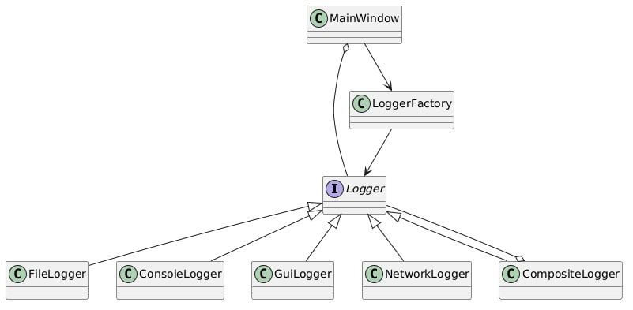

## Ключевые возможности 
- **4 типа логгеров**: File, Console, GUI, Network
- **Графический интерфейс**: управление логгерами через UI
- **Автоматическое управление памятью**: умные указатели

## Новая версия
- **Совместное использование через shared_ptr**
- **Композитный логгер для группировки**
- **Возможность иметь один логгер в нескольких группах**

## Схема взаимодействия классов

## Пояснение 
- -uo-|> = наследование **(LoggerFactory --> Logger)**
- o-- = содержит **(CompositeLogger o-- Logger)**
- --> = зависимость **(ConsoleLogger -up-|> Logger)**
